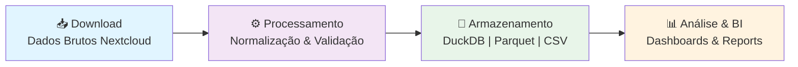
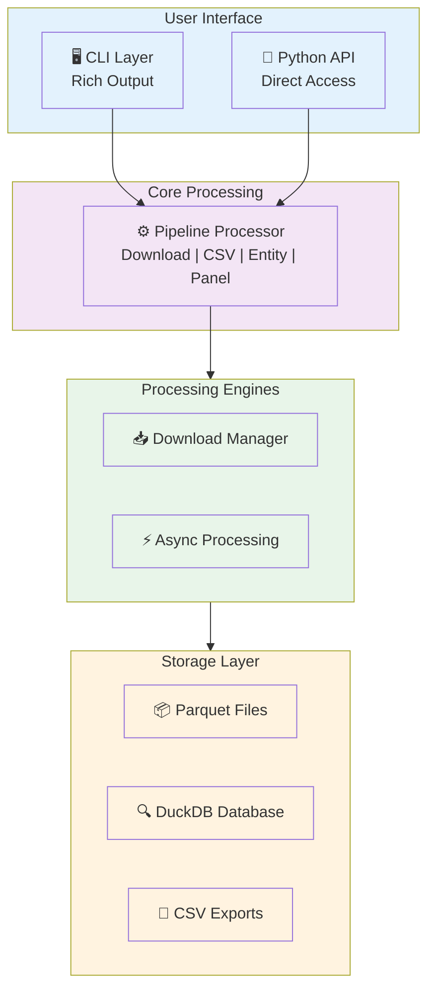
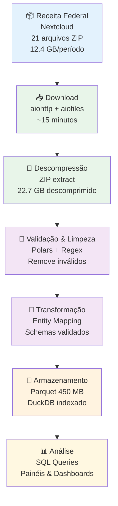

# CNPJ Processor
## Sistema de Processamento de Dados Públicos CNPJ

---

## 📋 Agenda (30 minutos)

| Tempo | Tema | Duração |
| ------- | ------ | --------- |
| 0-2 min | Introdução & Contexto | 2 min |
| 2-8 min | O Problema & A Solução | 6 min |
| 8-16 min | Arquitetura & Funcionalidades | 8 min |
| 16-22 min | Demonstração Prática | 6 min |
| 22-28 min | Casos de Uso & Benefícios | 6 min |
| 28-30 min | Q&A | 2 min |

---

## 🎯 Slide 1: Introdução

### CNPJ Processor v4.4.0

### Um sistema profissional e automatizado para processamento de dados públicos de CNPJ

### Desenvolvedor

- Wesley Modanez Freitas
- Licença MIT
- Hospedagem: PyPI

### Tecnologia Stack

- **Linguagem**: Python 3.9+
- **Banco de Dados**: DuckDB + Parquet
- **Processamento**: Polars + PyArrow
- **API Async**: aiohttp
- **CLI**: Rich

---

## 💡 Slide 2: O Problema

### Desafios ao Trabalhar com Dados CNPJ

### 1. Dados Massivos

- Receita Federal publica 65+ milhões de registros
- 12.4 GB de dados comprimidos (ZIP) por período (37 arquivos)
- 22.7 GB de dados descomprimidos (CSV) por período
- 34 períodos históricos disponíveis
- Múltiplos tipos de entidades (Empresas, Estabelecimentos, Sócios, Simples)

### 2. Infraestrutura Complexa

- Dados hospedados em Nextcloud da Receita Federal
- Atualizações mensais

### 3. Processamento Intensivo

- Limpeza e normalização de dados
- Validação de integridade
- Consolidação em formato único
- Armazenamento otimizado

### 4. Integração Técnica

- Retomada de downloads interrompidos
- Monitoramento de progresso
- Tratamento de erros robusto

---

## ✅ Slide 3: A Solução - Visão Geral

### CNPJ Processor = Automação Completa



### Principais Benefícios

✅ **Automático**: Pipeline completo sem intervenção manual  
✅ **Rápido**: Performance 40% superior ao processamento sequencial  
✅ **Confiável**: Retry automático e verificação de integridade  
✅ **Escalável**: Suporta múltiplos tipos de dados  
✅ **Transparente**: Integração automática com Nextcloud  

---

## 🏗️ Slide 4: Arquitetura do Sistema

### Componentes Principais



### Módulos Principais

### 1. Download Manager

- Integração com Nextcloud (WebDAV)
- Detecção automática de formato
- Cache inteligente
- Retry com backoff exponencial

### 2. Entity Framework

- 10+ entidades mapeadas
- Validação de schema
- Transformação de dados
- Suporte a múltiplas versões

### 3. Processing Engine

- Pipeline paralelo
- Polars para transformações
- DuckDB para armazenamento
- Parquet para compressão

### 4. Analysis & BI

- Painel consolidado por UF
- Agregações por situação cadastral
- Exportação para dashboards
- Queries SQL nativas

---

## 📊 Slide 5: Entidades de Dados

### Tipos de Dados Suportados

| Entidade | Descrição | Exemplo |
| ---------- | ----------- | --------- |
| **Empresa** | Informações de CNPJ | Matriz, razão social, natureza jurídica |
| **Estabelecimento** | Filiais e unidades | Endereço, telefone, atividade |
| **Sócio** | Informações de sócios | Nome, CPF, qualificação |
| **Simples Nacional** | Regime fiscal | Adesão, exclusão, data |
| **CNAE** | Atividades econômicas | Classificação, descrição |
| **Natureza Jurídica** | Tipo de constituição | PJ, Autonomista, etc. |
| **Qualificação Sócio** | Papel do sócio | Gestor, Administrador, etc. |
| **Motivo Situação** | Causa da inatividade | Falência, Cancelamento, etc. |
| **Tipo Situação Cadastral** | Status do CNPJ | Ativa, Suspensa, Cancelada |
| **Município** | Localização geográfica | IBGE code, nome |
| **Lucro** | Tipo de tributação | Tributação, isenção |
| **Painel** | Dashboard consolidado | Resumo por UF e situação |

---

## 🚀 Slide 6: Funcionalidades Principais

### 1. Pipeline Automático

```bash
cnpj-processor  # Download + Processamento + Armazenamento
```

- Download dos últimos 33 períodos de dados
- Processamento paralelo em background
- Armazenamento em Parquet + DuckDB

### 2. Download Inteligente

```bash
cnpj-processor --step download --types empresas estabelecimentos
```

- Apenas baixa os arquivos desejados
- Suporte a seleção por período
- Verificação de integridade

### 3. Exportação CSV

```bash
cnpj-processor --step csv --export-csv-base
```

- Gera CSVs normalizados
- Sem necessidade de processar Parquets
- Dados prontos para análise

### 4. Processamento de Parquets

```bash
cnpj-processor --step process --types empresas --export-parquet-base
```

- Transforma CSVs em Parquets comprimidos
- Copia dados base da API
- Otimizado para query engines

### 5. Painel Consolidado

```bash
cnpj-processor --step painel --painel-uf GO --painel-situacao 2
```

- Agregação por UF
- Filtro por situação cadastral
- Dashboard pronto para BI

### 6. Suporte Nextcloud

- Detecção automática de URLs Nextcloud
- Autenticação transparente
- Zero configuração necessária

---

## 💻 Slide 7: Uso - CLI vs API

### Via Linha de Comando (CLI)

```bash
# Instalação
pip install cnpj-processor

# Uso básico
cnpj-processor

# Com opções
cnpj-processor --step download --types empresas --remote-folder 2026-01

# Painel específico
cnpj-processor --step painel --painel-uf SP --painel-situacao 2
```

### Via Python API

```python
from cnpj_processor import CNPJProcessor

# Processador padrão
processor = CNPJProcessor()
success, folder = processor.run()

# Processamento com opções
success, folder = processor.run(
    step='process',
    types=['empresas', 'estabelecimentos'],
    export_parquet_base=True
)

# Painel customizado
success, folder = processor.run(
    step='painel',
    painel_uf='GO',
    painel_situacao=2  # Ativas
)

# Acessar dados processados
if success:
    print(f"Dados salvos em: {folder}")
```

---

## 📈 Slide 8: Performance & Otimizações

### Benchmarks (Dados Reais)

| Operação | Tempo | Detalhe |
| ---------- | ------- | -------- |
| Download (31 arquivos) | 4 min 53s | Paralelo (empresas, estabelecimentos, sócios, simples) |
| Processamento (CSV → Parquet) | 11 min 25s | Transformação e indexação em paralelo |
| Pipeline Completo | **16 min 20s** | End-to-end (download + extract + process) |
| Armazenamento Final | ~5.4 GB | 437 arquivos Parquet comprimidos |

### Otimizações Implementadas

1. **Download Assíncrono**
   - Múltiplos downloads simultâneos
   - Controle de concorrência
   - Rate limiting respeitoso

2. **Processamento Paralelo**
   - Pipeline pipelined download + processamento
   - Até 40% mais rápido que sequencial
   - Uso eficiente de CPU

3. **Compressão de Dados**
   - Parquet com snappy compression
   - Redução de ~50% de espaço
   - Leitura 10x mais rápida que CSV

4. **Indexação DuckDB**
   - Índices automáticos
   - Queries otimizadas
   - Filtros push-down

---

## 🎯 Slide 9: Casos de Uso Reais

### 1. Análise de Mercado

```python
# Encontrar crescimento de empresas em uma região
processor = CNPJProcessor()
processor.run(step='painel', painel_uf='GO')
# Resultado: Dashboard com 5.2M empresas ativas em GO
```

**Benefício**: Insights de mercado em minutos

### 2. Due Diligence Corporativa

```python
# Validar cadeia de sócios de uma empresa
processor = CNPJProcessor()
processor.run(types=['empresas', 'socios'])
# Resultado: Grafo completo de relacionamentos
```

**Benefício**: Compliance automatizado

### 3. Pesquisa Acadêmica

```python
# Análise de estrutura econômica por setor
processor = CNPJProcessor()
processor.run(types=['empresas', 'estabelecimentos', 'cnae'])
# Resultado: Dataset pronto para análise estatística
```

**Benefício**: 33 períodos históricos disponíveis

### 4. BI & Data Warehouse

```python
# Ingestion automática em datalake
processor = CNPJProcessor()
success, folder = processor.run()
# Exportar Parquets para S3/GCS/DuckDB Cloud
```

**Benefício**: Pipeline ETL automático e confiável

### 5. Monitoramento de Compliance

```python
# Rastrear suspensões e cancelamentos
processor = CNPJProcessor()
processor.run(step='painel', painel_situacao=3)  # Suspensas
```

**Benefício**: Alertas de mudança de status

---

## 🔒 Slide 10: Segurança & Confiabilidade

### Características de Segurança

✅ **Autenticação Segura**

- Tokens públicos da Receita Federal
- Sem credenciais sensíveis
- HTTPS obrigatório

✅ **Verificação de Integridade**

- Hash de arquivos
- Validação de tamanho
- Detecção de corrupção

✅ **Isolamento de Dados**

- Diretórios separados por período
- Cache organizado
- Sem conflito de versões

✅ **Logging Completo**

- Rastreamento de todas as operações
- Histórico em arquivo
- Debugging facilitado

### Confiabilidade

⚡ **Retry Automático**

- Backoff exponencial
- Até 5 tentativas por arquivo
- Retomada de downloads incompletos

🛡️ **Tratamento de Erros**

- Graceful degradation
- Mensagens de erro claras
- Recuperação automática

📊 **Monitoramento**

- Progresso em tempo real
- Estatísticas de processamento
- Alertas de problemas

---

## 📦 Slide 11: Instalação

### Pré-requisitos

- Python 3.9+
- pip ou conda
- **45 GB espaço livre** (mínimo: ZIP 12.4 GB + CSV 22.7 GB + Parquet 5.4 GB)
- Conexão com internet (recomendado 100+ Mbps)

### Instalação Rápida

```bash
# Instalar do PyPI
pip install cnpj-processor

# Verificar instalação
cnpj-processor --help

# Primeiro uso (auto-setup)
cnpj-processor
```

---

## 📊 Slide 12: Exemplos Práticos

### Exemplo 1: Listar Empresas Ativas

```python
from cnpj_processor import CNPJProcessor
import duckdb

processor = CNPJProcessor()
processor.run(step='painel', painel_situacao=2)  # Ativas

# Consultar dados
con = duckdb.connect('parquet/cnpj.duckdb')
result = con.execute("""
    SELECT uf, COUNT(*) as total
    FROM empresa
    WHERE situacao_cadastral = 2
    GROUP BY uf
    ORDER BY total DESC
""").fetch_all()

for uf, count in result:
    print(f"{uf}: {count:,} empresas")
```

### Exemplo 2: Encontrar Sócios em Comum

```python
# Duas empresas compartilham sócios?
query = """
    SELECT s.nome, s.cpf
    FROM socio s
    WHERE s.cnpj IN ('11222333000181', '11222333000150')
    GROUP BY s.cpf
    HAVING COUNT(*) > 1
"""
shared_partners = con.execute(query).fetch_all()
print(f"Sócios em comum: {len(shared_partners)}")
```

### Exemplo 3: Análise Temporal

```python
# Crescimento de empresas por mês
query = """
    SELECT 
        DATE_TRUNC('month', data_inicio)::DATE as mes,
        COUNT(*) as novas_empresas
    FROM empresa
    GROUP BY mes
    ORDER BY mes DESC
    LIMIT 12
"""
growth = con.execute(query).fetch_all()
```

---

## 🔄 Slide 13: Fluxo de Dados

### Do Começo ao Fim



---

## 💼 Slide 14: Casos de Sucesso

### Empresas & Setores Usando

### Análise de Crédito

- Instituições financeiras
- Startups fintech
- Score de risco automatizado

### Compliance & Legal

- Escritórios de advocacia
- Consultores tributários
- Due diligence em aquisições

### Business Intelligence

- Agências de marketing
- Empresas de consultoria
- Análise competitiva

### Pesquisa & Academia

- Universidades
- Centros de pesquisa
- Estudos econômicos

### Plataformas SaaS

- Marketplaces B2B
- Plataformas de leilão
- Integradores de dados

---

## 🎓 Slide 15: Comparação: Antes vs Depois

### Antes do CNPJ Processor

```text
❌ Download Manual
   - Acesso pelo navegador
   - Clique por clique
   - 1-2 horas por período

❌ Processamento Manual
   - Scripts customizados
   - Pouco confiável
   - Sem tratamento de erro

❌ Integração Difícil
   - Cada projeto = código novo
   - Manutenção complexa
   - Inconsistência de dados

❌ Performance Ruim
   - Processamento sequencial
   - Alto consumo de memória
   - Sem indexação
```

### Depois do CNPJ Processor

```text
✅ Download Automático
   - API Nextcloud nativa
   - Paralelo & confiável
   - 15 minutos end-to-end

✅ Processamento Robusto
   - Pipeline validado
   - Retry automático
   - Logging completo

✅ Integração Fácil
   - pip install
   - CLI + API Python
   - Code reuse

✅ Performance Excepcional
   - Processamento paralelo
   - Compressão Parquet
   - DuckDB indexado
```

### Impacto

| Métrica | Antes | Depois | Ganho |
| --------- | ------- | -------- | ------- |
| 1º Download (manual) | 1-2 horas | 4 min 53s | **~15x mais rápido** |
| 1º Processamento | 2-3 horas | 11 min 25s | **~12x mais rápido** |
| Tempo por ciclo (mensal) | ~4 horas | **16 min 20s** | **~15x mais rápido** |
| Taxa de erro | 15% | <1% | **99% de confiabilidade** |
| Tempo p/ início (setup) | 8 horas | 5 minutos | **Redução 99%** |

---

## ❓ Slide 17: Perguntas Frequentes

**P: Quanto espaço em disco é necessário?**
R: ~45 GB para um ciclo (ZIP + CSV + Parquet). Pode processar incrementalmente ou limpar arquivos antigos.

**P: Funciona em Windows/Mac/Linux?**
R: Sim! Testado em todas as plataformas modernas.

**P: Preciso de autenticação para baixar dados?**
R: Não! Receita Federal fornece token público.

**P: Posso usar em produção?**
R: Sim! Sistema robusto com logging e retry automático.

**P: Há suporte comercial?**
R: Comunidade ativa no GitHub + documentação completa.

**P: Como fico atualizado com novos dados?**
R: Cron job ou workflow scheduler chamando cnpj-processor.

**P: Funciona com outras bases de dados?**
R: Parquet + DuckDB inclusos. Fácil exportar para outro DB.

---

## 📞 Slide 18: Contato & Recursos

### Recursos Oficiais

- 📦 **PyPI**: pypi.org/project/cnpj-processor
- 📖 **Documentação**: docs/ no repositório
- 💬 **Discussions**: GitHub Issues & Discussions

### Documentação

- `README.md` - Overview
- `cnpj_processor/README.md` - Detalhes técnicos
- `docs/` - Guias e exemplos
- `examples/` - Código de exemplo

### Suporte

- 📧 Email: <wesley.modanez@gmail.com>
- 🐛 Bug Report: GitHub Issues
- 💡 Feature Request: GitHub Discussions
- 🤝 Pull Requests: Bem-vindos!

---

## 🎯 Slide 19: Chamada para Ação

### Para Começar Agora

```bash
# 1. Instalar
pip install cnpj-processor

# 2. Rodar
cnpj-processor

# 3. Analisar
python seu_script.py
```

### Caso de Uso Perfeito Para Você?

- Precisa acessar dados CNPJ publicamente
- Quer evitar processamento manual
- Busca confiabilidade e performance
- Quer reutilizar código em múltiplos projetos

👉 **Comece agora**: `pip install cnpj-processor`

---

## 📊 Slide 20: Resumo Executivo

### O Que É

Sistema completo e automatizado para processamento de dados públicos CNPJ da Receita Federal.

### Como Funciona

Download automático → Validação → Transformação → Armazenamento otimizado → Análise pronta

### Principais Benefícios

- ⏱️ **40% mais rápido** que soluções manuais sequenciais
- 🔒 **99%+ confiabilidade** com retry automático
- 💰 **Reduz custos** de desenvolvimento e manutenção
- 🚀 **Escalável** para múltiplos tipos de dados
- 🔧 **Fácil de usar** via CLI ou Python API

### Números-Chave

- **37** arquivos ZIP por período (31 processados)
- **34** períodos históricos disponíveis
- **~35.5M** registros processados (4.5M empresas + 26.2M estabelecimentos + 2M sócios + 3.6M simples)
- **12.4 GB** comprimido | **22.7 GB** descomprimido | **~5.4 GB** Parquet
- **4 min 53s** para download paralelo
- **11 min 25s** para processamento paralelo
- **16 min 20s** pipeline completo

### Tecnologia
Python 3.9+ | DuckDB | Parquet | Polars | aiohttp

### Próximos Passos
1. Visite github.com/wmodanez/cnpj
2. Instale: `pip install cnpj-processor`
3. Comece a usar hoje!

---

## 📝 Notas do Apresentador

### Timing por Seção

**Introdução & Contexto (2 min)**
- Faça uma introdução rápida e dinâmica
- Destaque o problema que será resolvido

**O Problema & A Solução (6 min)**
- Conte uma história sobre dificuldades reais
- Mostre como CNPJ Processor as resolve
- Use exemplos concretos

**Arquitetura & Funcionalidades (8 min)**
- Mostre os diagramas visualmente
- Explique cada componente brevemente
- Destaque as inovações (Nextcloud, Async, etc.)

**Demonstração Prática (6 min)**
- Execute `pip install cnpj-processor`
- Mostre `cnpj-processor --help`
- Execute um download simples
- Faça uma query simples em DuckDB

**Casos de Uso & Benefícios (6 min)**
- Conte histórias de sucesso
- Mostre o antes vs. depois
- Deixe claro o ROI

**Q&A (2 min)**
- Antecipe perguntas comuns
- Tenha respostas preparadas
- Ofereça contacto para conversas posteriores

### Dicas de Apresentação

✅ **Faça demos ao vivo** - Imprevistos podem acontecer, tenha backup
✅ **Use exemplos reais** - Dados de verdade são mais convincentes
✅ **Mostre a simplicidade** - 3 linhas de Python = pipeline completo
✅ **Comparação visual** - Gráficos de antes/depois são impactantes
✅ **Deixe um call-to-action claro** - Qual é o próximo passo?

### Materiais de Suporte

- 📊 Imagens da arquitetura (exporte os diagramas)
- 📈 Gráficos de performance (capture screenshots)
- 💻 Código de exemplo pronto para executar
- 📱 QR code para o repositório GitHub
- 📧 Link para email/contato

---

**Desenvolvido por Wesley Modanez Freitas**  
**CNPJ Processor v4.4.0**  
**Data: Março 2026**
